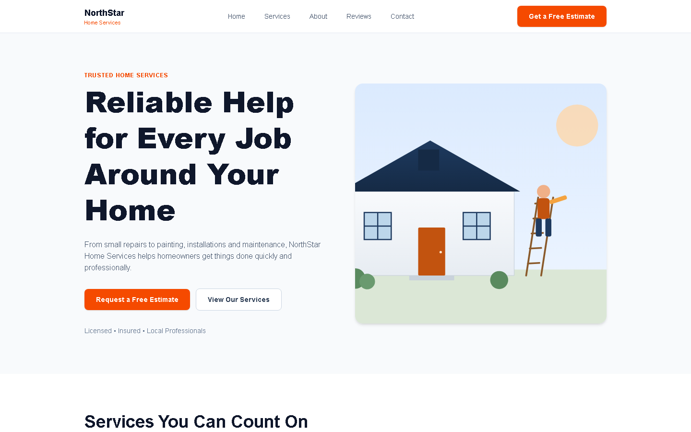
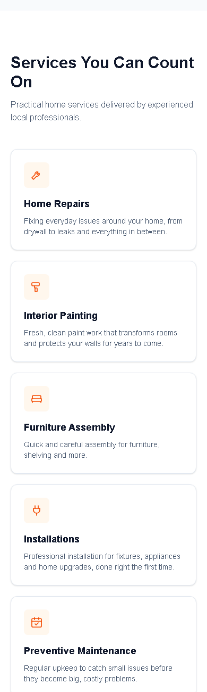
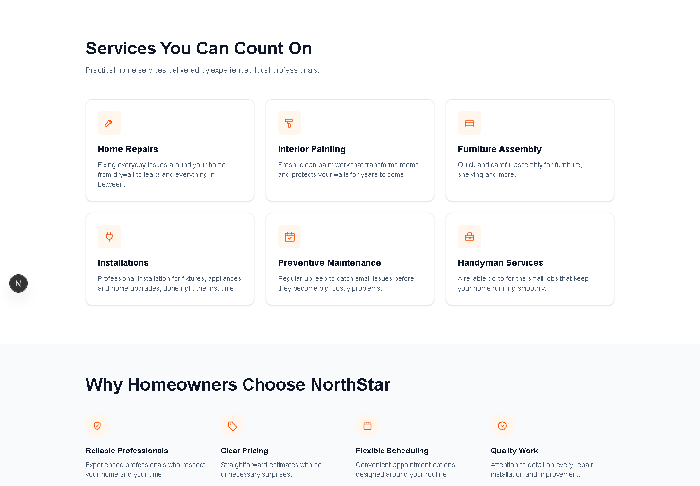

# NorthStar Home Services

### Website Fixes, Responsive Design & UI Improvements

NorthStar Home Services is a website improvement case focused on diagnosing an existing interface, correcting structural and responsive issues, and improving usability, clarity and overall presentation without rebuilding the project from scratch.

## Project Goal

The goal was to take an existing website with visible layout, mobile and usability problems and turn it into a cleaner, more consistent and more professional experience.

The work focused on practical improvements that could be delivered efficiently while preserving the original website's core structure.

## Live Demo

[View Live Website](https://northstar-home-services-woad.vercel.app)

## Before & After

### Desktop — Before

### Desktop — After

### Mobile — Before

### Mobile — After

## Responsive Improvements

## UI Improvements

## Full Case Study

A more detailed breakdown of the audit, fixes, responsive improvements, QA process and final positioning is available in [`docs/case-study.md`](docs/case-study.md).

## What Was Improved

- technical and visual audit;
- structural layout fixes;
- responsive and mobile corrections;
- spacing and alignment improvements;
- typography refinement;
- navigation improvements;
- CTA refinement;
- UI consistency;
- basic performance improvements;
- code quality cleanup;
- final QA;
- production deployment.

## Before → After Approach

The project followed a structured improvement workflow:

**Audit → Identify Problems → Fix Structure → Improve Responsive Behavior → Refine UI/UX → Test → Deploy**

This case demonstrates the ability to work on an existing codebase, identify problems, implement targeted corrections and validate the result across different screen sizes.

## Featured Areas

### Structural fixes
Layout problems, spacing inconsistencies and alignment issues were corrected to create a more stable visual structure.

### Responsive improvements
Desktop and mobile behavior were reviewed separately, with specific fixes applied to navigation, sections, cards, spacing and content flow.

### UI/UX refinement
The interface was refined to improve hierarchy, readability, consistency and the visibility of important actions.

### Performance and code quality
Basic cleanup and performance-oriented improvements were applied where appropriate before final QA.

### Final QA and deployment
The finished website was reviewed for visual consistency, responsive behavior and general functionality before the final production deployment.

## Skills Demonstrated

Website Fixes • Responsive Web Design • UI Implementation • UX Refinement • Debugging • Existing Codebase Analysis • Functional Testing • Performance Improvements • Production Deployment

## Case Study

A more detailed breakdown of the diagnosis, corrections and Before/After workflow is available in [`docs/case-study.md`](docs/case-study.md).

## Project Type

Website Improvement • Responsive Design • UI/UX Refinement • Frontend Debugging
